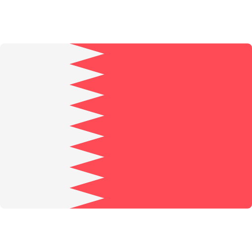

# Payment Gateways For Supported Countries

### This repository is always updated through new gateways

# مصر 

- Fawry Pay
- Strip
- PayMob
- Aman
- Payfort
- Vapulus

# عراق

- Zain Cash
- PayTabs
- Payu

# السعودية

- Paytabs
- 2checkout

# الامارات

- Telr
- PayTabs
- 2checkout

# قطر

- FasterPay
- Paymentwall
- 2Checkout

# الاردن

- 2checkout
- Mepspay
- Madfooat

# فلسطين

- FasterPay
- Paymentwall
- 2Checkout

# الجزائر

- FasterPay
- Paymentwall
- 2Checkou

# البحرين

- Paymentwall
- 2Checkout
- Atome